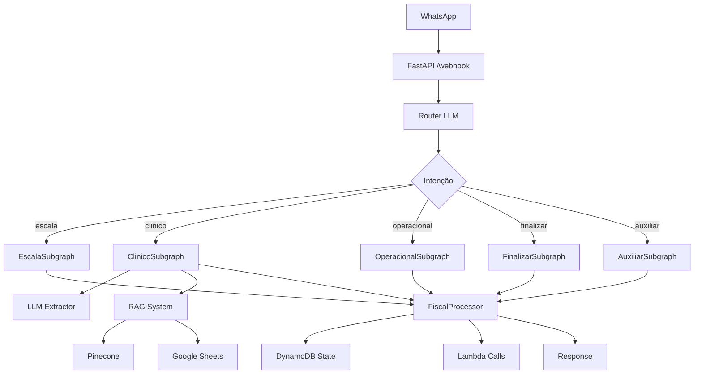

# WhatsApp Orchestrator

Sistema de orquestração de fluxos WhatsApp usando **Python + FastAPI + LangGraph**, com persistência em **DynamoDB** e processamento determinístico.

## 🚀 Características

- **Determinismo primeiro**: LLM apenas para classificar intenção e extrair dados clínicos (temp=0, JSON estrito)
- **Persistência DynamoDB**: Estado canônico sem Redis
- **Handlers síncronos**: Sem async/await
- **Subgrafos especializados**: router → {escala, clinico, operacional, finalizar, auxiliar} → fiscal
- **Two-phase commit**: Confirmações obrigatórias em escala, clínico e finalizar
- **Extração via LLM**: Sem regex para vitais, usando LLM estruturado
- **Sistema RAG**: Google Sheets + Pinecone para identificação de sintomas

## 📁 Estrutura do Projeto

```
.
├─ app/
│  ├─ api/
│  │  ├─ main.py                  # FastAPI (rotas síncronas)
│  │  └─ deps.py                  # configurações e dependências
│  ├─ graph/
│  │  ├─ state.py                 # GraphState (Pydantic v2)
│  │  ├─ router.py                # roteador determinístico + LLM
│  │  ├─ clinical_extractor.py    # orquestrador extração clínica
│  │  ├─ rag.py                   # integração Pinecone + Google Sheets
│  │  ├─ fiscal.py                # consolidador de resposta final
│  │  └─ subgraphs/
│  │     ├─ escala.py
│  │     ├─ clinico.py
│  │     ├─ operacional.py
│  │     ├─ finalizar.py
│  │     └─ auxiliar.py
│  ├─ infra/
│  │  ├─ dynamo_state.py          # persistência DynamoDB
│  │  ├─ http.py                  # cliente HTTP síncrono
│  │  └─ logging.py               # structlog PT-BR
│  └─ llm/
│     ├─ classifier.py            # classificador de intenção
│     └─ extractor.py             # extrator de vitais/nota
├─ tests/
├─ .env.example
├─ pyproject.toml
├─ Makefile
└─ README.md
```

## ⚙️ Instalação

### 1. Clone o repositório

```bash
git clone <url-do-repositorio>
cd whatsapp-orchestrator
```

### 2. Instale as dependências

**Opção A: usando Make**
```bash
make setup
```

**Opção B: manual**
```bash
pip install -e .
# ou para desenvolvimento:
pip install -e .[dev]
```

### 3. Configure variáveis de ambiente

```bash
cp .env.example .env
# Edite o arquivo .env com suas configurações
```

## 🔧 Configuração

### Variáveis de Ambiente Obrigatórias

```env
# OpenAI (para classificação e extração)
OPENAI_API_KEY=SEU_OPENAI_KEY
INTENT_MODEL=gpt-4o-mini
EXTRACTOR_MODEL=gpt-4o-mini

# AWS & Lambdas
AWS_REGION=sa-east-1
AWS_ACCESS_KEY_ID=seu-aws-key
AWS_SECRET_ACCESS_KEY=seu-aws-secret
LAMBDA_GET_SCHEDULE=https://sua-url.../getScheduleStarted
LAMBDA_UPDATE_CLINICAL=https://sua-url.../updateClinicalData

# DynamoDB
DYNAMODB_TABLE_CONVERSAS=Conversas
```

### Variáveis Opcionais (RAG)

```env
# Pinecone (para RAG de sintomas)
PINECONE_API_KEY=seu-pinecone-api-key
PINECONE_ENVIRONMENT=seu-ambiente
PINECONE_INDEX=seu-indice

# Google Sheets (base de sintomas)
GOOGLE_SHEETS_ID=seu-google-sheets-id
GOOGLE_CREDENTIALS_PATH=credentials/google-credentials.json
```

### DynamoDB - Tabela de Estado

Crie a tabela `Conversas` no DynamoDB:

- **Partition Key**: `session_id` (String)
- **Attributes**: 
  - `estado` (Binary) → GraphState serializado
  - `atualizadoEm` (String) → timestamp ISO

## 🏃 Execução

### Desenvolvimento

```bash
make run
# ou
uvicorn app.api.main:app --reload --host 0.0.0.0 --port 8000
```

### Produção

```bash
make run-prod
# ou
uvicorn app.api.main:app --host 0.0.0.0 --port 8000
```

### Verificação de Saúde

```bash
# Health check
curl http://localhost:8000/healthz

# Readiness check (valida configurações)
curl http://localhost:8000/readyz
```

## 📡 API

### POST /webhook/whatsapp

Webhook principal para mensagens do WhatsApp.

**Request:**
```json
{
  "message_id": "abc123",
  "phoneNumber": "5511999999999", 
  "text": "PA 120x80 FC 75 FR 18",
  "meta": {}
}
```

**Response:**
```json
{
  "reply": "Salvei seus vitais (PA 120x80, FC 75, FR 18). Faltam: Sat, Temp para finalizar.",
  "session_id": "5511999999999",
  "status": "success"
}
```

## 🔄 Fluxos Suportados

### 1. Escala (com confirmação)
```
Usuário: "confirmo presença"
Sistema: "Confirma sua presença no plantão?"
Usuário: "sim"
Sistema: "Presença confirmada. O que mais deseja fazer?"
```

### 2. Clínico (com confirmação)
```
Usuário: "PA 120x80 FC 75 paciente com tosse"
Sistema: "Confirma salvar: Vitais: PA 120x80, FC 75; Nota: paciente com tosse; Sintomas identificados: 1"
Usuário: "sim"  
Sistema: "Dados clínicos salvos com sucesso!"
```

### 3. Operacional (direto, sem confirmação)
```
Usuário: "Paciente dormindo tranquilo"
Sistema: "Nota administrativa registrada: 'Paciente dormindo tranquilo'"
```

### 4. Finalizar (com confirmação)
```
Usuário: "finalizar plantão"
Sistema: "Confirma a finalização do plantão? Todos os dados serão enviados."
Usuário: "sim"
Sistema: "Plantão finalizado com sucesso! Obrigado pelo seu trabalho."
```

### 5. Auxiliar
```
Usuário: "ajuda"
Sistema: "Posso ajudar você com: [instruções detalhadas]"
```

## 🧪 Testes

```bash
# Executar todos os testes
make test
# ou
pytest tests/ -v

# Teste específico
pytest tests/test_router.py -v

# Com coverage
pytest tests/ --cov=app --cov-report=html
```

### Teste Manual do Webhook

```bash
make test-webhook
# ou
curl -X POST "http://localhost:8000/webhook/whatsapp" \
  -H "Content-Type: application/json" \
  -d '{
    "message_id": "test123",
    "phoneNumber": "5511999999999", 
    "text": "PA 120x80 FC 75",
    "meta": {}
  }'
```

## 🔍 Extração de Vitais

O sistema usa **LLM estruturado** (não regex) para extrair sinais vitais:

### Formatos Suportados
- **PA**: "120x80", "12/8" (se inequívoco) → normaliza para "120x80"
- **FC**: "75", "75 bpm" → 75
- **FR**: "18", "18 rpm" → 18  
- **Sat**: "97", "97%" → 97
- **Temp**: "36,8", "36.8°C" → 36.8

### Validações Automáticas
- **FC**: 20-220 bpm
- **FR**: 5-50 irpm
- **Sat**: 50-100%
- **Temp**: 30.0-43.0°C
- **PA**: Sistólica 70-260, Diastólica 40-160

### Exemplos

```
"PA 120x80 FC 75 FR 18 Sat 97 Temp 36.8 paciente com tosse"
→ Vitais: PA=120x80, FC=75, FR=18, Sat=97, Temp=36.8
→ Nota: "paciente com tosse"
→ RAG identifica sintomas da nota
```

```
"PA 12/8 e febre leve"  
→ Vitais: PA=null (ambíguo), outros=null
→ Nota: "febre leve"
→ Warning: "PA_ambigua_12_8"
```

## 🔧 Sistema RAG (Opcional)

### Google Sheets
Formato esperado da planilha:
| sintoma | pontuacao |
|---------|-----------|
| Tosse seca | 3 |
| Febre | 5 |
| Dor abdominal | 4 |

### Pinecone
- Índice com embeddings de sintomas
- Metadata: `{"symptom": "nome", "category": "categoria"}`

## 🚨 Troubleshooting

### Erro: "Variáveis de ambiente obrigatórias não configuradas"
- Verifique se `.env` existe e contém `OPENAI_API_KEY`, `LAMBDA_GET_SCHEDULE`, etc.

### Erro: "Tabela DynamoDB não está acessível"
- Verifique credenciais AWS
- Confirme que a tabela `Conversas` existe
- Teste: `curl http://localhost:8000/readyz`

### LLM retorna JSON inválido
- O sistema tem retry automático
- Logs mostrarão warnings com `"falha_json_llm"`

### RAG não funciona
- Verifique `PINECONE_API_KEY` e `GOOGLE_CREDENTIALS_PATH`
- RAG é opcional; sistema funciona sem ele

## 📊 Logs

Logs estruturados em JSON (PT-BR):

```json
{"evento":"entrada","session_id":"5511999999999","texto":"PA 120x80"}
{"evento":"intencao","intencao":"clinico"}
{"evento":"extracao","vitais_encontrados":["PA"],"tem_nota":false}
{"evento":"lambda","nome":"updateClinicalData","status":"200"}
```

Nível de log configurável via `LOG_LEVEL` (DEBUG, INFO, WARNING, ERROR).

## 🏗️ Arquitetura



## 🤝 Contribuindo

1. Fork o projeto
2. Crie uma branch (`git checkout -b feature/nova-funcionalidade`)
3. Commit suas mudanças (`git commit -am 'Adiciona nova funcionalidade'`)
4. Push para a branch (`git push origin feature/nova-funcionalidade`)
5. Abra um Pull Request

## 📄 Licença

Este projeto está sob a licença MIT. Veja o arquivo `LICENSE` para mais detalhes.

---

**WhatsApp Orchestrator** - Sistema completo de orquestração de fluxos de saúde domiciliar 🏥📱
