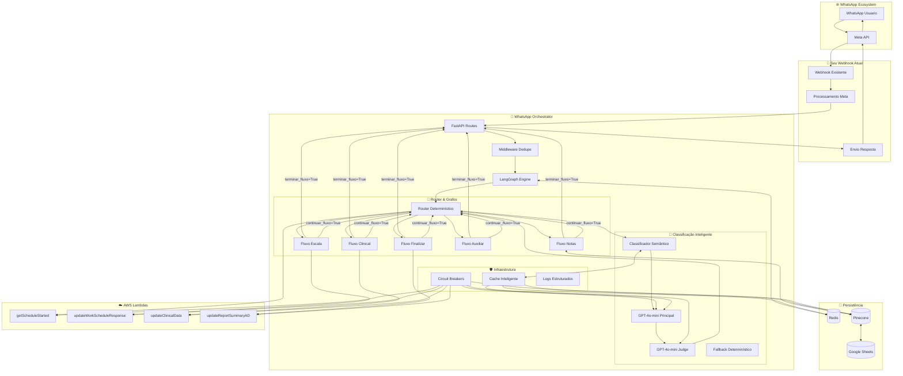

# 🏗️ Diagrama Completo da Arquitetura WhatsApp Orchestrator

## 🔄 Fluxo Completo de Informação



## 🎯 Detalhamento dos Componentes

### 1. **Entrada de Dados**
```
WhatsApp → Meta API → Seu Webhook → POST /webhook/whatsapp
```

**Payload de Entrada:**
```json
{
  "message_id": "msg_123456",
  "phoneNumber": "+5511999999999",
  "text": "cheguei, confirmo presença"
}
```

### 2. **Processamento FastAPI**
```python
# 1. Middleware de Deduplicação
if redis.exists(f"msg:{message_id}"):
    return cached_response

# 2. Criação do Estado Inicial
estado = GraphState(
    core=CoreState(session_id="session_5511999999999", ...),
    vitals=VitalsState(),
    nota=NoteState(),
    router=RouterState(),
    aux=AuxState(),
    texto_usuario="cheguei, confirmo presença"
)

# 3. Execução do Grafo
resultado = grafo.invoke(estado, config={"thread_id": session_id})
```

### 3. **Engine LangGraph**
```python
# Grafo com 6 nós conectados:
grafo = StateGraph(GraphState)
grafo.add_node("router", router_node)      # Decisão
grafo.add_node("escala", escala_node)      # Presença
grafo.add_node("clinical", clinical_node)  # Sinais Vitais
grafo.add_node("notas", notas_node)        # Notas Clínicas
grafo.add_node("finalizar", finalizar_node) # Encerramento
grafo.add_node("auxiliar", auxiliar_node)  # Orientações

# Fluxo: router → fluxo_específico → router (ciclo)
#        ou router → fluxo_específico → END (termina)
```

### 4. **Router Determinístico (Prioridades)**
```python
async def route(estado: GraphState) -> str:
    # 1. Bootstrap da sessão (se necessário)
    if not estado.core.schedule_id:
        await obter_dados_turno(estado)  # Lambda getScheduleStarted
    
    # 2. Retomada pendente (maior prioridade)
    if estado.aux.retomar_apos:
        return estado.aux.retomar_apos["flow"]
    
    # 3. Pergunta pendente (two-phase commit)
    if estado.aux.ultima_pergunta:
        return processar_pergunta_pendente(estado)
    
    # 4. Classificação Semântica (LLM)
    resultado = await classify_semantic(estado.texto_usuario, estado)
    
    # 5. Gates de Negócio (sempre prevalecem)
    if resultado.intent == "finalizar" and not sv_completos:
        estado.aux.retomar_apos = {"flow": "finalizar"}
        return "clinical"  # Força coleta de SV primeiro
    
    # 6. Mapeamento final
    return mapear_intencao_para_fluxo(resultado.intent)
```

### 5. **Classificação Semântica Inteligente**
```python
# Classificação Principal
resultado = await _executar_classificacao_llm(texto, estado)
# ↓
# GPT-4o-mini (temp=0.1) classifica intenção
# ↓
# Se confiança < 0.8 → LLM as a Judge valida/corrige
# ↓
# Circuit Breaker aberto → Fallback Determinístico
```

### 6. **Fluxos Específicos**

#### **Escala Flow (Presença)**
```python
# 1. Detectar intenção: "cheguei" → CONFIRMAR_PRESENCA
# 2. Staging: criar acao_pendente
# 3. Pergunta: "Confirma presença no plantão de 15/01? (sim/não)"
# 4. Commit: se "sim" → Lambda updateWorkScheduleResponse
# 5. Bootstrap: re-carregar dados com getScheduleStarted
```

#### **Clinical Flow (Sinais Vitais)**
```python
# 1. Extração: "PA 120x80, FC 78" → {"PA": "120x80", "FC": 78}
# 2. Coleta Incremental: faltantes = ["FR", "Sat", "Temp"]
# 3. Pergunta faltantes ou Staging completo
# 4. Commit: Lambda updateClinicalData (7 cenários)
# 5. Marcar: sinais_vitais_realizados = True
```

#### **Notas Flow (Observações)**
```python
# 1. Classificação: "paciente consciente" → NOTA_CLINICA
# 2. RAG Pinecone: buscar sintomas similares
# 3. Staging: nota + sintomas identificados
# 4. Commit: Lambda updateClinicalData (NOTE_SYMPTOMS)
```

#### **Finalizar Flow (Encerramento)**
```python
# 1. Validação: presença OK + sinais vitais OK
# 2. Montar relatório final
# 3. Staging: dados do relatório
# 4. Commit: Lambda updateReportSummaryAD → envia DailyReport
```

### 7. **Two-Phase Commit (TPC)**
```python
# Staging
estado.aux.acao_pendente = {
    "fluxo_destino": "escala_commit",
    "payload": {"scheduleIdentifier": "...", "responseValue": "confirmado"},
    "expires_at": now + 10_minutes
}
estado.aux.ultima_pergunta = "Confirma presença? (sim/não)"

# Commit (próxima mensagem "sim")
if is_yes(texto):
    await executar_lambda(estado.aux.acao_pendente["payload"])
    limpar_acao_pendente(estado)
```

### 8. **Persistência Redis**
```python
# Checkpointing LangGraph
redis.set(f"checkpoint:{session_id}", pickle.dumps(estado))

# Cache LLM
redis.setex(f"cache:llm:{hash}", 1800, json.dumps(resultado))

# Deduplicação
redis.setex(f"msg:{message_id}", 600, json.dumps(resposta))
```

### 9. **Circuit Breakers**
```python
@circuit_breaker("llm_classifier", LLM_CIRCUIT_CONFIG)
async def _executar_classificacao_llm():
    # Falhas: 3 → Abrir circuito por 30s
    # Fallback: classificação determinística

@circuit_breaker("lambda_update_clinical", LAMBDA_CIRCUIT_CONFIG)  
async def _executar_update_clinical_data():
    # Falhas: 5 → Abrir circuito por 60s
    # Retry com backoff exponencial
```

### 10. **Saída de Dados**
```json
{
  "success": true,
  "message": "✅ Presença confirmada! Agora você pode informar sinais vitais...",
  "session_id": "session_5511999999999",
  "next_action": "clinical"
}
```

## 🔄 Exemplos de Fluxos Completos

### **Happy Path: Presença → SV → Finalizar**
```
1. Usuário: "cheguei"
   → Router → Semantic (CONFIRMAR_PRESENCA) → Escala Flow
   → "Confirma presença? (sim/não)"

2. Usuário: "sim"
   → Router → Pergunta Pendente → Escala Commit
   → Lambda updateWorkScheduleResponse → Bootstrap
   → "✅ Presença confirmada!"

3. Usuário: "PA 120x80, FC 78, FR 18, Sat 97%, Temp 36.5"
   → Router → Semantic (SINAIS_VITAIS) → Clinical Flow
   → Todos coletados → "Confirma salvar SV? (sim/não)"

4. Usuário: "sim"
   → Router → Pergunta Pendente → Clinical Commit
   → Lambda updateClinicalData → "✅ Dados salvos!"

5. Usuário: "finalizar"
   → Router → Semantic (FINALIZAR_PLANTAO) → Gates OK → Finalizar Flow
   → "Confirma finalizar? Relatório: ..."

6. Usuário: "sim"
   → Finalizar Commit → Lambda updateReportSummaryAD
   → "✅ Plantão finalizado! DailyReport enviado."
```

### **Retomada: Finalizar sem SV**
```
1. Usuário: "quero finalizar"
   → Router → Semantic (FINALIZAR_PLANTAO) → Gate: SV faltantes
   → aux.retomar_apos = "finalizar" → Clinical Flow
   → "Para finalizar, precisa informar SV primeiro..."

2. Usuário: "PA 130x90, FC 85, FR 16, Sat 98%, Temp 36.2"
   → Router → Clinical Flow → SV completos → Commit
   → Router → Retomada Pendente → Finalizar Flow
   → "✅ SV salvos! Agora finalizando plantão..."
```

### **Coleta Incremental**
```
1. Usuário: "PA 120x80"
   → Clinical Flow → Faltantes: [FC, FR, Sat, Temp]
   → "Coletado PA. Faltam: FC, FR, Sat, Temp"

2. Usuário: "FC 78, Sat 97%"
   → Clinical Flow → Faltantes: [FR, Temp]
   → "Coletados FC e Sat. Faltam: FR, Temp"

3. Usuário: "FR 18, Temp 36.8"
   → Clinical Flow → Completos → "Confirma salvar todos?"
```

## 🎯 Pontos Críticos para Testes

### ✅ **Funcionais**
1. **Classificação Semântica**: Diferentes formas de expressar intenções
2. **Two-Phase Commit**: Confirmação/cancelamento de todas as ações
3. **Coleta Incremental**: SV enviados aos poucos
4. **Retomada de Contexto**: Fluxos interrompidos e retomados
5. **Gates de Negócio**: Regras sempre prevalecendo

### ✅ **Não-Funcionais**
1. **Circuit Breakers**: Falhas de LLM/Lambda
2. **Cache**: Hit/miss rates e TTL
3. **Deduplicação**: Mensagens duplicadas
4. **Checkpointing**: Persistência de estado
5. **Performance**: < 1s end-to-end

### ✅ **Integração**
1. **Webhook**: Formato correto de entrada/saída
2. **Redis**: Conexão e persistência
3. **Pinecone**: RAG funcionando
4. **Lambdas**: 4 endpoints respondendo
5. **OpenAI**: Classificação semântica ativa

Esta arquitetura garante um sistema **robusto**, **inteligente** e **determinístico** que mantém compatibilidade total com sua infraestrutura existente! 🚀
