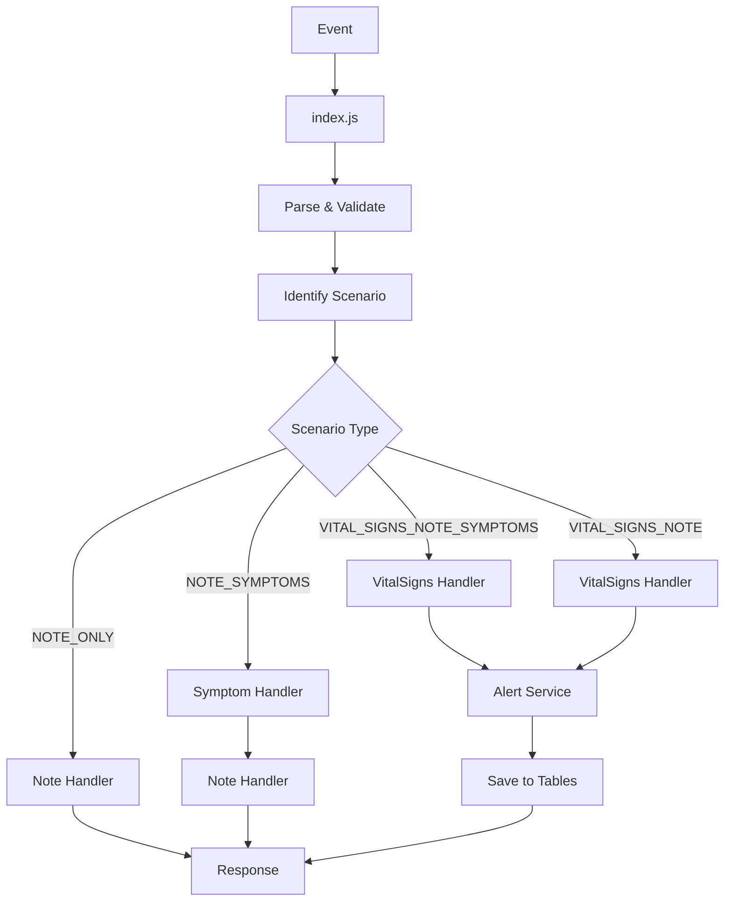

# 🏗️ Arquitetura do UpdateClinicalData

## 📁 Estrutura de Arquivos Organizada

O projeto foi reorganizado em uma estrutura modular e clara:

```
src/
├── index.js                    # 🎯 Handler principal (108 linhas)
├── handlers/                   # 📝 Processadores específicos
│   ├── noteHandler.js         # 📋 Processamento de NoteReport
│   ├── symptomHandler.js      # 🩺 Processamento de SymptomReport  
│   └── vitalSignsHandler.js   # 💓 Processamento de sinais vitais
├── services/                   # ⚙️ Lógica de negócio
│   └── alertServiceComplete.js# 🚨 Serviço completo de alertas
└── utils/                      # 🔧 Utilitários
    ├── symptomFormatter.js     # 📊 Formatação de sintomas
    └── scenarioIdentifier.js  # 🎯 Identificação de cenários
```

## 📊 Redução de Complexidade

### Antes:
- **1 arquivo**: 1578 linhas
- **Difícil manutenção**: Tudo misturado
- **Baixa legibilidade**: Funções enormes

### Depois:
- **8 arquivos organizados**: ~200 linhas cada
- **Separação clara**: Cada arquivo tem uma responsabilidade
- **Alta legibilidade**: Código modular e bem estruturado

## 🎯 Responsabilidades

### `src/index.js` (Handler Principal)
- **Função**: Entry point do Lambda
- **Responsabilidades**:
  - Parse do event
  - Identificação do cenário
  - Validações básicas
  - Orquestração dos handlers
  - Montagem da resposta

### `src/handlers/noteHandler.js`
- **Função**: Processamento de NoteReport
- **Responsabilidades**:
  - Fluxo família vs normal
  - Salvamento em Reports/FamilyReports
  - Gestão de AdminInfo e AlterationsReport

### `src/handlers/symptomHandler.js`
- **Função**: Processamento de SymptomReport
- **Responsabilidades**:
  - Processamento de sintomas e scores
  - Verificação de recorrência
  - Criação de alertas por sintomas
  - Salvamento em Reports/FamilyReports/SymptomReports

### `src/handlers/vitalSignsHandler.js`
- **Função**: Processamento de sinais vitais
- **Responsabilidades**:
  - Validação de ranges
  - Cálculo de scores absolutos
  - Estatísticas históricas
  - Orquestração do serviço de alertas

### `src/services/alertServiceComplete.js`
- **Função**: Lógica completa de alertas
- **Responsabilidades**:
  - Alertas por z-score/variações
  - Alertas por sinais vitais críticos
  - Mudança de risco para crítico
  - Salvamento em tabelas
  - Webhooks

### `src/utils/symptomFormatter.js`
- **Função**: Formatação de sintomas
- **Responsabilidades**:
  - Conversão para formato DynamoDB
  - Inclusão de score e alert
  - Compatibilidade com diferentes fontes

### `src/utils/scenarioIdentifier.js`
- **Função**: Identificação de cenários
- **Responsabilidades**:
  - Análise dos campos do body
  - Determinação do fluxo de processamento

## 🔄 Fluxo de Execução



## ✅ Benefícios da Nova Arquitetura

### 🧹 **Manutenibilidade**
- **Separação clara**: Cada arquivo tem uma responsabilidade específica
- **Fácil localização**: Sabe exatamente onde está cada funcionalidade
- **Mudanças isoladas**: Alterar alertas não afeta processamento de notas

### 📈 **Escalabilidade**
- **Novos cenários**: Fácil adicionar novos handlers
- **Novas funcionalidades**: Modular sem quebrar o existente
- **Testes unitários**: Cada módulo pode ser testado independentemente

### 👥 **Colaboração**
- **Múltiplos devs**: Podem trabalhar em arquivos diferentes
- **Code review**: Mais fácil revisar mudanças específicas
- **Onboarding**: Novos desenvolvedores entendem mais rápido

### 🔧 **Debugging**
- **Stack traces**: Mais claros com arquivos específicos
- **Logs focados**: Cada handler tem seus próprios logs
- **Isolamento**: Problemas ficam contidos em módulos específicos

## 🎯 Compatibilidade Total

### ✅ **Funcionalidades Mantidas**
- **100% das funcionalidades** dos 3 lambdas originais
- **Mesma API**: Não há breaking changes
- **Mesmos cenários**: Todos os 4 cenários funcionais
- **Mesmas tabelas**: Salva nos mesmos locais

### ✅ **Melhorias Adicionadas**
- **Alertas por z-score**: Implementação completa
- **Mudança de risco**: Detecção de mudança para crítico
- **Score/Alert nos sintomas**: Campos adicionais implementados
- **Agregação completa**: Todos os alertas viram sintomas

## 🚀 Deploy e Uso

O deploy continua exatamente igual:

```bash
# Build e deploy
./deploy.sh

# Testes
./test.sh all
```

**Nenhuma mudança** é necessária na infraestrutura ou nas chamadas do Lambda! 🎉
